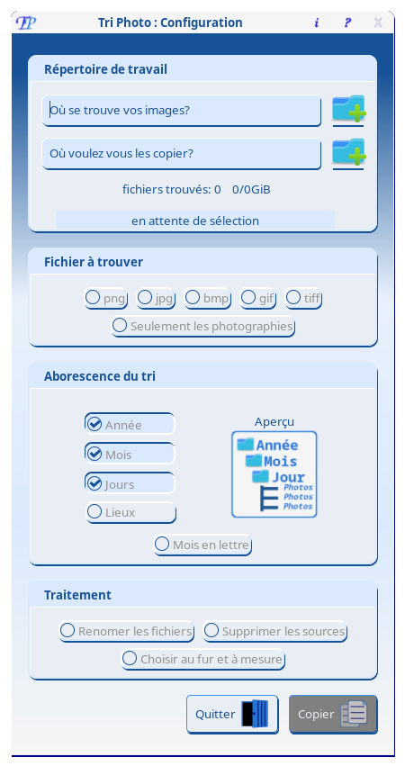

#  tri_photo (tp) 


tri_photo est un programme écrit en rust, il utilise gtk4 pour son interface graphique.

Il permet de regrouper, dans un meme répertoire hiérachisé de destination, des images dispersées sur son disque ou tout autre support.


***

## Table des matières

- 📦 [Prérequis](#prérequis)
- 🚀 [Installation](#installation)
- 🛠️ [Utilisation](#utilisation)
- 🤝 [Contributeurs](#contributeurs)
- 💬 [Retour](#retour)
- 🏷️ [Historique des versions](#historique-des-versions)
- 📝 [Licence](#licence)

## Prérequis

Pour installer le programme vous aurez besoin des dependances suivant

* cargo
* gtk4

> sous Archlinux

* base-devel
  
Fonctionne avec tous les systemes d'exploitation, les suivants ont été testés :
* Archlinux

## Installation

Pour le mement seul archlinux a été testé

<details>
    <summary> Archlinux</summary>

```
        git clone https://gitlab.archlinux.org/nfili/tri_photo.git
        cd tri_photo
        makepkg
        sudo pacman -U tri_photo-[version]-1.pkg.tar.zst
```
</details>

<details>
    <summary> autre linux</summary>

```
        git clone https://github.com/nfili/tri_photo.git
        cd tri_photo
        cargo build --release 
        sudo ./install.sh
```
</details>

### Désinstallation

<details>
    <summary> Archlinux</summary>

```
        sudo pacman -R tri_photo
```
</details>

<details>
    <summary> autre linux</summary>

```
        cd chemin/des/sources 
        sudo ./uninstall.sh
```
</details>

## Utilisation

### Répertoire de travail

* répertoire source : permet de sélectionner le répertoire où le programme doit chercher
  - exemple : /home/{user}/Downloads
* répertoire de desticnation : permet de choisir l'emplacement où les fichiers seront copier ou déplacer
  - exemple : /home/{user}/save

### Fichiers à trouver

* sélection des types de fichier image

### Arborescence du tri

Sélection de la structure du répertoire de déstination via des options propposées :

* jour
* mois
* année
* lieux (pour les photos).
* mois en lettre

### Traitement

Sélection des option de traitement des fichiers : 
 * Renomer les fichiers
 * Supprimer les sources
 * Gestion au fur et à mesure

## Contributeurs

<a href="https://github.com/nfili/tri_photo/graphs/contributors">
  
</a>

## Retour

> Vous pouvez améliorer ce projet, n'hésitez pas à ouvrir une  [Pull Request](https://github.com/nfili/tri_photo/pulls).
- Si vous constatez un bug ou une faute de frappe utilisez la balise "Correction".
- Si vous souhaitez partager des idées pour améliorer ce projet, utilisez la balise « Amélioration ».

<details>
    <summary>Contacter Moi 📨</summary>

### Contact<!-- Required -->
Contactez-moi par email: [nicolasfilippozzi@gmail.com](mailto:nicolasfilippozzi@gmail.com)
<!-- 
* nicolasfilippozzi@gmail.com
* Nicolas Filippozzi
-->
    
</details>

## Historique des versions
* 1.0.0
  * Premiére version de test pre-release

## Licence

Voir les fichiers :
* [LICENSE-MIT](./LICENSE-MIT) du dépôt.
* [LICENCE-APACHE](./LICENCE-APACHE) du dépôt.
